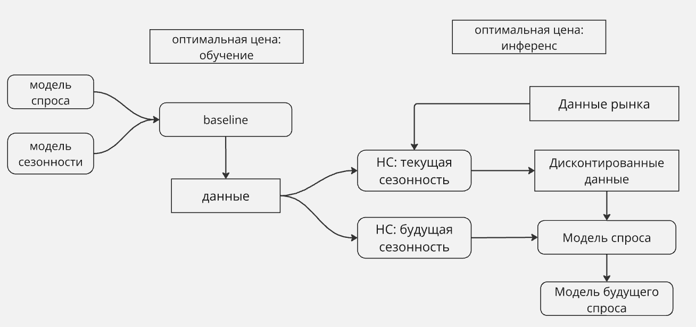

# Модуль оптимальной цены и/или предсказания спроса

## baseLine
Модель спроса, включает тренд и сезонность (для обучения НС)

## neural_net
Нейросети, обученные на base_line

## inference

## optim_price_v2
Оптимальная цена с учетом наличия на маркете

## optim_price_v3 
Оптимлальная цена, в которой вероятность наличия на складе считает нейросеть

